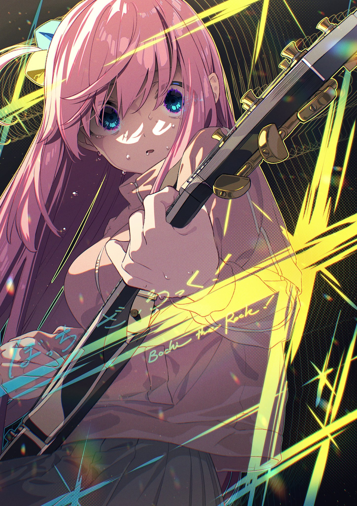
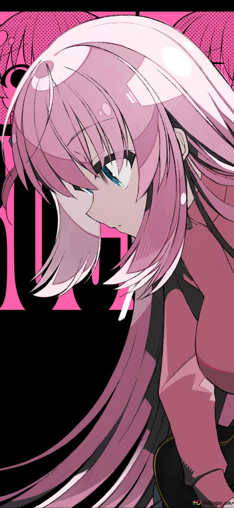

<div align="center">


</div>

## 🎸 Sobre el proyecto

<p align="center">
  
</p>

**BocchiTheRock-MD** es un bot de WhatsApp Multi-Device en español, inspirado en la estética de *Bocchi the Rock!*. Su base modular incluye herramientas para grupos, descargas, stickers, anime, economía, juegos y reacciones.

> Proyecto independiente de WhatsApp y de los titulares de la obra. Las imágenes de personajes son material de referencia y deben sustituirse por recursos propios o con licencia compatible antes de una distribución comercial.

## 🧭 Estado del proyecto

- 🧪 **Base adaptada:** derivada con permiso del autor de la base original.
- 🔐 **Sin sesiones ni credenciales:** nunca subas `Sessions/`, tokens o claves.
- 🛡️ **Funciones sensibles aisladas:** pagos, NSFW, webviews, catálogos y metadatos criptográficos heredados están en `disabled-plugins/`.
- 🧩 **Trabajo por módulos:** cada función debe probarse antes de habilitarse.

## ✨ Características

| Función | Descripción |
|:---|:---|
| 🎨 Menús | Menús multimedia, categorías y botones nativos seguros |
| 🎭 Reacciones | Hug, pat, kiss, dance, happy, sad y otras reacciones anime |
| 📥 Descargas | YouTube, TikTok, Instagram, Facebook y más |
| 🖼️ Stickers | Conversión de imágenes y videos a stickers |
| 🧠 IA | Integraciones configurables mediante variables de entorno |
| 👥 Grupos | Moderación, bienvenida, despedida, advertencias y administración |
| 🎮 Juegos | Economía, gacha y juegos para grupos |
| 🛠️ Utilidades | QR, traducción, GitHub, búsqueda y conversores |

## 📱 Instalación en Termux — Android

> Ejecuta cada bloque por separado. No pegues todo junto si Termux muestra un error.

### 1. Instalar Termux

Descarga Termux desde [F-Droid](https://f-droid.org/packages/com.termux/) o desde su [repositorio oficial](https://github.com/termux/termux-app). No mezcles versiones de distintas fuentes.

### 2. Preparar paquetes

```bash
pkg update && pkg upgrade -y
pkg install -y git nodejs-lts python ffmpeg imagemagick
```

### 3. Descargar el proyecto

```bash
git clone https://github.com/riokuroxi-svg/BocchiTheRock-MD.git
cd BocchiTheRock-MD
```

### 4. Instalar dependencias

```bash
npm install
```

Si npm se interrumpe o quedaron dependencias incompletas:

```bash
rm -rf node_modules package-lock.json
npm install
```

### 5. Crear configuración local

```bash
cp .env.example .env
nano .env
```

Configura al menos:

```env
PREFIX=.
BOT_NAME=BocchiTheRock-MD
OWNER_NUMBER=521XXXXXXXXXX
INSTAGRAM_URL=
CHANNEL_URL=
```

No publiques el archivo `.env`.

### 6. Iniciar

```bash
npm start
```

Escanea el QR desde **WhatsApp → Dispositivos vinculados → Vincular dispositivo**.

### 7. Mantener activo en Termux

```bash
termux-wake-lock
npm start
```

Para detener el proceso:

```text
Ctrl + C
```

## 🖥️ Instalación en VPS / Linux

```bash
sudo apt update
sudo apt install -y git nodejs npm python3 ffmpeg imagemagick
git clone https://github.com/riokuroxi-svg/BocchiTheRock-MD.git
cd BocchiTheRock-MD
cp .env.example .env
npm install
npm start
```

## ⚙️ Configuración y variables

La configuración se realiza mediante `.env`. Las claves de IA son opcionales y solo deben existir en el entorno local:

```env
GEMINI_API_KEY=
GINKO_API_KEY=
NODE_ENV=production
```

La sesión se almacena localmente en `Sessions/` y está excluida por `.gitignore`.

## 🧪 Comandos de prueba

Después de conectar el bot, prueba gradualmente:

```text
.menu
.hug
.pat
.kiss
.dance
.infobot
```

Las funciones experimentales deben probarse en un grupo privado antes de habilitarlas para todos.

## 🖼️ Recursos visuales

<p align="center">
  
  
</p>

Los recursos visuales incluidos son material de referencia. Reemplázalos por arte propio, generado con permiso o con licencia compatible si vas a redistribuir el proyecto.

## 🔒 Seguridad

No habilites sin revisión:

```text
pagos
catálogos comerciales
ubicación
open_webview
NSFW
scripts de shell para usuarios
metadatos de sesiones ajenas
```

Nunca copies:

```text
mediaKey
fileSha256
fileEncSha256
directPath
senderKeyDistributionMessage
certificados
firmas
```

## 🤝 Créditos

- Base adaptada con permiso del autor original.
- [Baileys](https://github.com/WhiskeySockets/Baileys) y su comunidad.
- [riokuroxi-svg](https://github.com/riokuroxi-svg).
- *Bocchi the Rock!* pertenece a sus respectivos titulares.

## 📄 Licencia

Consulta el archivo `LICENSE`. Revisa también las licencias de las dependencias y de los recursos visuales antes de redistribuir.

<div align="center">


</div>
